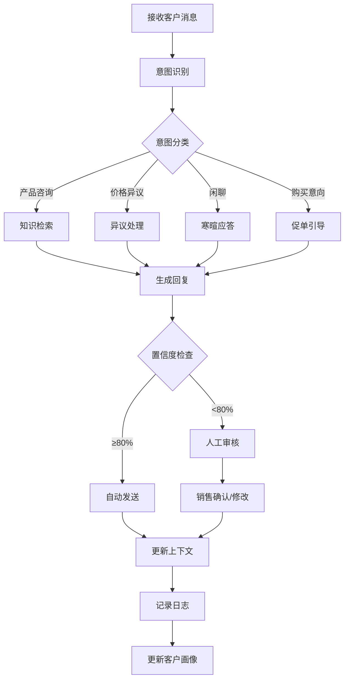

# 销售AI助手四期 - 天九系统集成设计方案

**版本**: v2.0
**创建日期**: 2026-01-14
**设计重点**: 兼容天九现有系统 + 销售智能体对接

---

## 📋 目录

1. [项目背景与目标](#项目背景与目标)
2. [天九现有系统分析](#天九现有系统分析)
3. [系统集成架构设计](#系统集成架构设计)
4. [销售智能体对接方案](#销售智能体对接方案)
5. [数据集成与同步方案](#数据集成与同步方案)
6. [功能模块对接设计](#功能模块对接设计)
7. [用户体系与权限对接](#用户体系与权限对接)
8. [实施路线图](#实施路线图)

---

## 🎯 项目背景与目标

### 核心需求

1. **系统兼容性**: 与天九现有的AI智能销售助手平台无缝对接
2. **智能体集成**: 对接外部销售智能体，实现智能回复和手动回复双模式
3. **销售体系融合**: 结合天九现有销售流程，不改变用户习惯
4. **数据打通**: 客户、会话、知识库数据双向同步

### 项目目标

| 维度 | 现状 | 目标 | 价值 |
|------|------|------|------|
| **系统整合** | 多套系统独立运行 | 统一平台入口 | 减少切换成本 |
| **智能体能力** | 手动回复为主 | AI智能回复+人工辅助 | 响应速度提升10倍 |
| **数据利用** | 数据孤岛 | 数据全链路打通 | 沉淀销售资产 |
| **销售效率** | 人工跟进 | 自动培育+智能提醒 | 转化率提升200% |

---

## 🔍 天九现有系统分析

### 现有系统架构

基于产品手册分析，天九现有系统包含以下核心模块：

#### 1. 前端展示平台

```
┌─────────────────────────────────────────────────────────┐
│                   天九AI销售助手平台                      │
├─────────────────────────────────────────────────────────┤
│  ┌──────────┐ ┌──────────┐ ┌──────────┐ ┌──────────┐  │
│  │ 客户管理 │ │ 会话管理 │ │ 培育计划 │ │ 知识库   │  │
│  └──────────┘ └──────────┘ └──────────┘ └──────────┘  │
│  ┌──────────┐ ┌──────────┐ ┌──────────┐ ┌──────────┐  │
│  │智能体管理│ │ 数据看板 │ │ 系统设置 │ │ 操作日志 │  │
│  └──────────┘ └──────────┘ └──────────┘ └──────────┘  │
└─────────────────────────────────────────────────────────┘
```

#### 2. 后台管理系统

```
┌─────────────────────────────────────────────────────────┐
│                     后台管理平台                         │
├─────────────────────────────────────────────────────────┤
│  ┌──────────┐ ┌──────────┐ ┌──────────┐ ┌──────────┐  │
│  │ 数据总览 │ │ 模型管理 │ │ 用户管理 │ │ 会话管理 │  │
│  └──────────┘ └──────────┘ └──────────┘ └──────────┘  │
│  ┌──────────┐ ┌──────────┐ ┌──────────┐               │
│  │ 知识库   │ │ Token管理│ │ 操作日志 │               │
│  └──────────┘ └──────────┘ └──────────┘               │
└─────────────────────────────────────────────────────────┘
```

### 现有功能模块详解

#### 客户管理体系

| 功能 | 说明 | 对接需求 |
|------|------|----------|
| **公海池** | 未分配客户池 | 需双向同步领取/退回 |
| **我的客户** | 销售名下客户 | 需实时同步状态 |
| **客户标签** | 自定义标签体系 | 需打通标签API |
| **客户转移** | 跨销售转移客户 | 需触发通知机制 |
| **客户分配** | 管理员批量分配 | 需记录分配规则 |

#### 会话管理体系

| 功能 | 说明 | 对接需求 |
|------|------|----------|
| **会话列表** | 历史对话记录 | 需全量同步 |
| **实时对话** | 即时通讯功能 | 需接入智能体 |
| **会话详情** | 完整对话上下文 | 需结构化存储 |
| **消息类型** | 文本/图片/文件 | 需统一格式转换 |

#### 智能体管理体系

| 功能 | 说明 | 对接需求 |
|------|------|----------|
| **智能体列表** | 多智能体管理 | 需扩展智能体类型 |
| **参数配置** | Temperature/Top_P等 | 需支持销售智能体参数 |
| **提示词模板** | 系统提示词管理 | 需集成销冠话术 |
| **模型切换** | GPT-4/Claude等 | 需支持销售智能体模型 |

#### 知识库体系

| 功能 | 说明 | 对接需求 |
|------|------|----------|
| **知识库列表** | 分类知识管理 | 需双向同步 |
| **新增知识** | Q&A录入 | 需自动提炼机制 |
| **知识分类** | 多级分类体系 | 需保持一致 |
| **搜索功能** | 关键词检索 | 需增强语义搜索 |

#### 培育计划体系

| 功能 | 说明 | 对接需求 |
|------|------|----------|
| **培育列表** | 线索培育任务 | 需扩展自动化规则 |
| **培育设置** | 时间/内容配置 | 需支持7天标准SOP |
| **培育记录** | 执行历史 | 需分析转化效果 |

### 现有技术栈推断

```typescript
// 推断的技术架构
interface ExistingSystem {
  frontend: {
    framework: "React/Vue",          // 基于UI风格推断
    ui: "Ant Design/Element UI",     // 企业级组件库
    state: "Redux/Vuex",             // 状态管理
  };
  backend: {
    framework: "Node.js/Java",       // 常见企业后端
    database: "MySQL/PostgreSQL",    // 关系型数据库
    cache: "Redis",                  // 缓存层
  };
  ai: {
    llm: "OpenAI/Claude",            // LLM模型
    embedding: "OpenAI Embeddings",  // 向量模型
    vectorDb: "Milvus/Pinecone",     // 向量数据库
  };
  integration: {
    wechat: "企业微信API",           // 企业微信对接
    crm: "自研CRM",                  // 内部CRM系统
  };
}
```

---

## 🏗️ 系统集成架构设计

### 整体架构图

```
┌─────────────────────────────────────────────────────────────────┐
│                         用户交互层                               │
│  ┌─────────────┐  ┌─────────────┐  ┌─────────────┐             │
│  │天九现有前端 │  │四期新增功能 │  │移动端应用   │             │
│  └─────────────┘  └─────────────┘  └─────────────┘             │
└─────────────────────────────────────────────────────────────────┘
                              ↕
┌─────────────────────────────────────────────────────────────────┐
│                      API网关层 (统一入口)                        │
│  ┌──────────────┐  ┌──────────────┐  ┌──────────────┐          │
│  │ 路由策略     │  │ 鉴权认证     │  │ 限流熔断     │          │
│  └──────────────┘  └──────────────┘  └──────────────┘          │
└─────────────────────────────────────────────────────────────────┘
                              ↕
┌─────────────────────────────────────────────────────────────────┐
│                      业务服务层 (微服务)                         │
│  ┌──────────────┐  ┌──────────────┐  ┌──────────────┐          │
│  │天九现有服务  │  │四期新增服务  │  │智能体服务    │          │
│  ├──────────────┤  ├──────────────┤  ├──────────────┤          │
│  │• 客户服务    │  │• BANT提取    │  │• 销售智能体  │          │
│  │• 会话服务    │  │• 情感分析    │  │• 对话生成    │          │
│  │• 知识库服务  │  │• 销冠克隆    │  │• 智能路由    │          │
│  │• 培育服务    │  │• 自动培育    │  │• 多模型管理  │          │
│  └──────────────┘  └──────────────┘  └──────────────┘          │
└─────────────────────────────────────────────────────────────────┘
                              ↕
┌─────────────────────────────────────────────────────────────────┐
│                      数据访问层 (DAO)                            │
│  ┌──────────────┐  ┌──────────────┐  ┌──────────────┐          │
│  │ ORM/ODM     │  │ 向量数据库   │  │ 缓存层       │          │
│  └──────────────┘  └──────────────┘  └──────────────┘          │
└─────────────────────────────────────────────────────────────────┘
                              ↕
┌─────────────────────────────────────────────────────────────────┐
│                         数据存储层                               │
│  ┌──────────────┐  ┌──────────────┐  ┌──────────────┐          │
│  │ PostgreSQL  │  │ Milvus       │  │ Redis        │          │
│  │ (业务数据)   │  │ (向量数据)   │  │ (缓存/队列)  │          │
│  └──────────────┘  └──────────────┘  └──────────────┘          │
└─────────────────────────────────────────────────────────────────┘
```

### 分层设计说明

#### 1. 用户交互层

**策略**: 前端集成 + 无缝切换

```typescript
// 前端集成方案
interface FrontendIntegration {
  // 方案A: 嵌入式集成（推荐）
  embedded: {
    approach: "iframe/Web Component",
    advantage: "最小改动、快速上线",
    scenario: "在现有页面嵌入四期新功能模块"
  };

  // 方案B: 页面跳转
  redirect: {
    approach: "SSO单点登录",
    advantage: "独立部署、互不影响",
    scenario: "完全独立的页面，通过SSO打通"
  };

  // 方案C: 组件级复用
  component: {
    approach: "npm包共享",
    advantage: "UI一致、代码复用",
    scenario: "共享基础组件库"
  };
}
```

#### 2. API网关层

**策略**: 统一入口 + 路由分发

```typescript
// API网关配置
interface APIGateway {
  // 统一域名
  domain: "api.tianjiu-sales.com";

  // 路由规则
  routes: {
    // 天九现有API
    existing: "/api/v1/*",

    // 四期新增API
    phase4: "/api/v4/*",

    // 智能体API
    agent: "/api/agent/*"
  };

  // 认证方式
  auth: {
    type: "JWT",
    sso: "支持天九现有SSO系统",
    refresh: "自动刷新token"
  };

  // 限流策略
  rateLimit: {
    default: "100 req/min",
    ai: "10 req/min",  // AI接口更严格
    admin: "1000 req/min"
  };
}
```

#### 3. 业务服务层

**策略**: 服务解耦 + 接口标准化

```typescript
// 服务注册与发现
interface ServiceRegistry {
  // 天九现有服务
  existingServices: [
    "CustomerService",      // 客户管理
    "ConversationService",  // 会话管理
    "KnowledgeService",     // 知识库管理
    "NurtureService"        // 培育计划
  ];

  // 四期新增服务
  phase4Services: [
    "BANTExtractionService",   // BANT提取
    "SentimentService",        // 情感分析
    "ChampionCloneService",    // 销冠克隆
    "AutoNurtureService"       // 自动培育
  ];

  // 智能体服务
  agentServices: [
    "SalesAgentService",       // 销售智能体
    "DialogEngine",            // 对话引擎
    "ModelRouter"              // 模型路由
  ];
}
```

#### 4. 数据访问层

**策略**: 数据库共享 + Schema扩展

```sql
-- 共享数据库方案
-- 方案A: Schema隔离（推荐）
CREATE SCHEMA tianjiu_existing;  -- 天九现有数据
CREATE SCHEMA phase4_new;        -- 四期新增数据
-- 通过数据库视图或联合查询实现数据互通

-- 方案B: 表前缀区分
tianjiu_customers       -- 天九现有客户表
phase4_customer_analysis -- 四期分析结果表
-- 通过外键关联

-- 方案C: 同步表
-- 定时任务同步核心数据字段
```

---

## 🤖 销售智能体对接方案

### 销售智能体架构

```
┌─────────────────────────────────────────────────────────────┐
│                    销售智能体系统                            │
├─────────────────────────────────────────────────────────────┤
│                                                              │
│  ┌──────────────────────────────────────────────────────┐   │
│  │              智能体路由层 (Agent Router)               │   │
│  │  ┌────────────┐  ┌────────────┐  ┌────────────┐     │   │
│  │  │意图识别    │  │场景分流    │  │模型选择    │     │   │
│  │  └────────────┘  └────────────┘  └────────────┘     │   │
│  └──────────────────────────────────────────────────────┘   │
│                           ↓                                  │
│  ┌──────────────────────────────────────────────────────┐   │
│  │            智能体执行层 (Agent Engine)                 │   │
│  │  ┌────────────┐  ┌────────────┐  ┌────────────┐     │   │
│  │  │销售智能体  │  │知识问答    │  │培育助理    │     │   │
│  │  │(核心)      │  │智能体      │  │智能体      │     │   │
│  │  └────────────┘  └────────────┘  └────────────┘     │   │
│  └──────────────────────────────────────────────────────┘   │
│                           ↓                                  │
│  ┌──────────────────────────────────────────────────────┐   │
│  │              模型调用层 (LLM Gateway)                 │   │
│  │  ┌────────────┐  ┌────────────┐  ┌────────────┐     │   │
│  │  │GPT-4o     │  │Claude 3.5  │  │销售专用模型│     │   │
│  │  └────────────┘  └────────────┘  └────────────┘     │   │
│  └──────────────────────────────────────────────────────┘   │
│                           ↓                                  │
│  ┌──────────────────────────────────────────────────────┐   │
│  │              上下文管理层 (Context Manager)            │   │
│  │  ┌────────────┐  ┌────────────┐  ┌────────────┐     │   │
│  │  │对话历史    │  │客户画像    │  │知识检索    │     │   │
│  │  └────────────┘  └────────────┘  └────────────┘     │   │
│  └──────────────────────────────────────────────────────┘   │
│                                                              │
└─────────────────────────────────────────────────────────────┘
```

### 销售智能体核心能力

基于销售智能体代码分析，核心能力包括：

#### 1. 智能回复引擎

```typescript
interface SalesAgentCapabilities {
  // 核心能力
  capabilities: {
    // 智能对话
    conversation: {
      realtimeReply: "实时生成回复建议",
      multiTurn: "多轮对话上下文理解",
      emotionAware: "情感识别与适配",
      personalized: "基于客户画像个性化"
    },

    // 销售专业知识
    salesKnowledge: {
      objectionHandling: "异议处理话术库",
      negotiation: "谈判策略与技巧",
      closing: "促单时机与方法",
      followUp: "跟进策略与节奏"
    },

    // 情报分析
    intelligence: {
      bantExtraction: "BANT信息自动提取",
      painPoint: "客户痛点识别",
      competitor: "竞品分析与应对",
      riskWarning: "流失风险预警"
    }
  };
}
```

#### 2. 智能体配置参数

```typescript
// 销售智能体配置接口
interface SalesAgentConfig {
  // 基础配置
  basic: {
    agentId: string;           // 智能体ID
    agentName: string;         // 智能体名称
    agentType: "sales" | "support" | "general";
    description: string;       // 功能描述
  };

  // 模型配置
  model: {
    provider: "openai" | "claude" | "custom";  // 模型提供商
    modelName: string;        // 模型名称
    temperature: number;      // 温度参数 (0-1)
    maxTokens: number;        // 最大token数
    topP: number;            // 采样参数
    frequencyPenalty: number; // 频率惩罚
    presencePenalty: number;  // 存在惩罚
  };

  // 提示词配置
  prompt: {
    systemPrompt: string;     // 系统提示词
    fewShots: Array<{         // 少样本示例
      input: string;
      output: string;
    }>;
    customInstructions: string; // 自定义指令
  };

  // 上下文配置
  context: {
    maxHistoryTurns: number;  // 最大历史轮数
    enableRAG: boolean;       // 启用RAG检索
    knowledgeBaseIds: string[]; // 关联知识库
    enableCustomerProfile: boolean; // 启用客户画像
  };

  // 行为配置
  behavior: {
    autoReply: boolean;       // 自动回复
    autoReplyDelay: number;   // 自动回复延迟(秒)
    humanIntervention: boolean; // 人工干预
    confidenceThreshold: number; // 置信度阈值
  };
}
```

#### 3. 智能体工作流程



### 销售智能体接入方式

#### 方案A: API对接（推荐）

```typescript
// 智能体API封装
class SalesAgentClient {
  private baseUrl: string;
  private apiKey: string;

  // 发送消息给智能体
  async sendMessage(params: {
    conversationId: string;
    message: string;
    customerProfile?: CustomerProfile;
    context?: ConversationContext;
  }): Promise<AgentResponse> {
    const response = await fetch(`${this.baseUrl}/agent/chat`, {
      method: 'POST',
      headers: {
        'Authorization': `Bearer ${this.apiKey}`,
        'Content-Type': 'application/json'
      },
      body: JSON.stringify({
        agent_id: 'sales_agent_v1',
        message: params.message,
        customer_profile: params.customerProfile,
        context: params.context,
        config: {
          enable_rag: true,
          enable_bant_extraction: true,
          temperature: 0.7
        }
      })
    });

    return response.json();
  }

  // 获取智能体建议（不自动发送）
  async getSuggestion(params: {
    conversationId: string;
    lastMessage: string;
  }): Promise<AgentSuggestion> {
    // 类似sendMessage，但返回建议而非自动发送
  }
}
```

#### 方案B: WebSocket实时通信

```typescript
// WebSocket连接管理
class SalesAgentWebSocket {
  private ws: WebSocket;

  connect(conversationId: string) {
    this.ws = new WebSocket(`wss://api.tianjiu.com/agent/ws`);

    this.ws.onmessage = (event) => {
      const data = JSON.parse(event.data);

      switch (data.type) {
        case 'suggestion':
          // 显示智能体建议
          this.showSuggestion(data.content);
          break;
        case 'auto_reply':
          // 自动回复（如已启用）
          this.handleAutoReply(data.content);
          break;
        case 'bant_update':
          // BANT信息更新
          this.updateBANT(data.bant_data);
          break;
      }
    };
  }

  // 采纳建议
  acceptSuggestion(suggestionId: string) {
    this.ws.send(JSON.stringify({
      type: 'accept',
      suggestion_id: suggestionId
    }));
  }
}
```

#### 方案C: 消息队列异步处理

```typescript
// 消息队列集成
class SalesAgentMQ {
  // 生产者：发送消息到队列
  async publishMessage(params: {
    conversationId: string;
    message: string;
    priority: 'high' | 'normal' | 'low';
  }) {
    await redis.rpush('agent:queue', JSON.stringify({
      id: generateId(),
      conversation_id: params.conversationId,
      message: params.message,
      priority: params.priority,
      timestamp: Date.now()
    }));
  }

  // 消费者：处理队列消息
  async consumeMessages() {
    while (true) {
      const data = await redis.blpop('agent:queue', 0);
      const message = JSON.parse(data);

      // 调用智能体生成回复
      const response = await this.callAgent(message);

      // 发布回复到结果队列
      await redis.rpush('agent:results', JSON.stringify(response));
    }
  }
}
```

### 人工与智能协同机制

```typescript
// 人机协同配置
interface HumanAISynergy {
  // 工作模式
  modes: {
    // 模式1: AI辅助（推荐）
    assist: {
      description: "AI生成建议，人工确认后发送",
      workflow: "客户消息 → AI生成建议 → 销售修改/采纳 → 发送",
      advantage: "保持人工控制，提升回复质量",
      suitable: "重要客户、复杂场景"
    };

    // 模式2: AI自动回复
    auto: {
      description: "AI直接回复，特定场景触发人工介入",
      workflow: "客户消息 → AI判断 → 自动回复 OR 人工处理",
      advantage: "提升响应速度，减轻人工负担",
      suitable: "常见问题、标准化场景"
    };

    // 模式3: 人工主导
    manual: {
      description: "人工回复，AI提供背景信息和建议",
      workflow: "客户消息 → AI分析意图 → 人工撰写 → AI润色",
      advantage: "完全人工控制，AI辅助决策",
      suitable: "高价值客户、敏感场景"
    };
  };

  // 场景化切换规则
  scenarioRules: {
    // 高价值客户 → 人工主导
    highValue: {
      trigger: "客户等级 >= A级",
      mode: "manual"
    };

    // 常见问题 → AI自动回复
    faq: {
      trigger: "意图识别 = 常见咨询 AND 置信度 >= 90%",
      mode: "auto"
    };

    // 异议处理 → AI辅助
    objection: {
      trigger: "意图识别 = 价格/竞品异议",
      mode: "assist"
    };

    // 工作时间外 → AI自动回复
    afterHours: {
      trigger: "当前时间 NOT IN 工作时间",
      mode: "auto",
      note: "次日上午人工跟进"
    };
  };
}
```

---

## 🔄 数据集成与同步方案

### 数据集成架构

```
┌───────────────────────────────────────────────────────────┐
│                     数据集成层                              │
├───────────────────────────────────────────────────────────┤
│                                                            │
│  ┌─────────────────────────────────────────────────────┐ │
│  │           数据同步引擎 (Sync Engine)                  │ │
│  │  ┌───────────┐  ┌───────────┐  ┌───────────┐       │ │
│  │  │实时同步   │  │定时同步   │  │按需同步   │       │ │
│  │  │(WebSocket)│  │(Cron Job) │  │(API Call) │       │ │
│  │  └───────────┘  └───────────┘  └───────────┘       │ │
│  └─────────────────────────────────────────────────────┘ │
│                          ↓                                │
│  ┌─────────────────────────────────────────────────────┐ │
│  │          数据转换层 (Data Transformer)               │ │
│  │  ┌───────────┐  ┌───────────┐  ┌───────────┐       │ │
│  │  │格式转换   │  │数据清洗   │  │数据验证   │       │ │
│  │  └───────────┘  └───────────┘  └───────────┘       │ │
│  └─────────────────────────────────────────────────────┘ │
│                          ↓                                │
│  ┌─────────────────────────────────────────────────────┐ │
│  │           数据映射层 (Data Mapper)                   │ │
│  │  ┌───────────┐  ┌───────────┐  ┌───────────┐       │ │
│  │  │天九Schema │  │四期Schema │  │智能体Schema│       │ │
│  │  └───────────┘  └───────────┘  └───────────┘       │ │
│  └─────────────────────────────────────────────────────┘ │
│                            ↓                              │
│  ┌─────────────────────────────────────────────────────┐ │
│  │              存储层 (Storage)                        │ │
│  │  ┌──────────┐   ┌──────────┐   ┌──────────┐        │ │
│  │  │PostgreSQL│   │ Milvus   │   │  Redis   │        │ │
│  │  └──────────┘   └──────────┘   └──────────┘        │ │
│  └─────────────────────────────────────────────────────┘ │
└───────────────────────────────────────────────────────────┘
```

### 核心数据实体映射

#### 1. 客户数据映射

```typescript
// 客户数据映射
interface CustomerMapping {
  // 天九系统客户数据
  tianjiuCustomer: {
    id: string;
    name: string;
    phone?: string;
    email?: string;
    company?: string;
    industry?: string;
    source?: string;
    tags?: string[];
    status: "potential" | "active" | "closed";
    ownerId: string;
    createdAt: Date;
    updatedAt: Date;
  };

  // 四期分析数据
  phase4Analysis: {
    customerId: string;  // 关联天九客户ID
    bantData?: {
      budget: BANTInfo;
      authority: BANTInfo;
      need: BANTInfo;
      timeline: BANTInfo;
    };
    sentimentScore?: number;
    riskLevel?: "low" | "medium" | "high";
    engagementLevel?: number;
    lastInteractionAt?: Date;
    nextFollowUpAt?: Date;
  };

  // 同步策略
  syncStrategy: {
    // 实时同步：客户状态变化
    realtime: ["status", "ownerId"];

    // 定时同步：客户基本信息（每小时）
    scheduled: {
      interval: "1h",
      fields: ["name", "company", "tags"]
    };

    // 按需同步：详情查看时
    onDemand: ["email", "phone", "industry"];
  };
}
```

#### 2. 会话数据映射

```typescript
// 会话数据映射
interface ConversationMapping {
  // 天九会话数据
  tianjiuConversation: {
    id: string;
    customerId: string;
    channel: "wechat" | "email" | "phone";
    messages: Array<{
      id: string;
      senderId: string;
      senderType: "customer" | "sales" | "system";
      content: string;
      messageType: "text" | "image" | "file";
      timestamp: Date;
    }>;
    createdAt: Date;
    updatedAt: Date;
  };

  // 四期分析数据
  phase4Analysis: {
    conversationId: string;
    extractedInfo?: {
      painPoints: string[];
      objections: string[];
      competitors: string[];
      interests: string[];
    };
    sentimentTrajectory?: Array<{
      timestamp: Date;
      score: number;
    }>;
    keyMoments?: Array<{
      type: "price_discussion" | "competitor_mention" | "buying_signal";
      timestamp: Date;
      description: string;
    }>;
  };

  // 同步策略
  syncStrategy: {
    // 实时同步：新消息到达
    realtime: ["messages"],

    // 异步分析：会话结束后或每小时
    asyncAnalysis: {
      trigger: "message_added OR hourly",
      tasks: ["sentiment_analysis", "entity_extraction", "key_moments"]
    };
  };
}
```

#### 3. 知识库数据映射

```typescript
// 知识库数据映射
interface KnowledgeMapping {
  // 天九知识库
  tianjiuKnowledge: {
    id: string;
    question: string;
    answer: string;
    category?: string;
    tags?: string[];
    status: "published" | "draft";
    createdBy: string;
    createdAt: Date;
    updatedAt: Date;
  };

  // 四期增强数据
  phase4Enhancement: {
    knowledgeId: string;
    embedding?: number[];  // 向量嵌入
    qualityScore?: number; // 质量评分
    usageCount?: number;   // 使用次数
    feedbackScore?: number; // 反馈评分
    suggestedImprovements?: string[]; // 改进建议
    autoGenerated: boolean; // 是否AI生成
  };

  // 同步策略
  syncStrategy: {
    // 实时同步：增删改操作
    realtime: ["create", "update", "delete"],

    // 定时处理：向量化、质量评分
    scheduled: {
      interval: "30min",
      tasks: ["generate_embedding", "calculate_quality"]
    };
  };
}
```

### 数据同步实现

#### 方案A: 基于事件驱动的实时同步

```typescript
// 事件驱动同步
class EventDrivenSync {
  private eventBus: EventEmitter;

  // 监听天九系统事件
  subscribeToTianjiuEvents() {
    // 客户变化事件
    this.on('customer.created', this.handleCustomerCreated);
    this.on('customer.updated', this.handleCustomerUpdated);
    this.on('customer.assigned', this.handleCustomerAssigned);

    // 会话事件
    this.on('conversation.message_added', this.handleMessageAdded);
    this.on('conversation.ended', this.handleConversationEnded);

    // 知识库事件
    this.on('knowledge.created', this.handleKnowledgeCreated);
    this.on('knowledge.updated', this.handleKnowledgeUpdated);
  }

  // 处理客户创建
  private async handleCustomerCreated(event: CustomerEvent) {
    // 1. 数据转换
    const phase4Data = this.transformCustomer(event.data);

    // 2. 存储到四期数据库
    await this.phase4Db.customers.create(phase4Data);

    // 3. 触发BANT分析（异步）
    await this.queueBANTAnalysis(event.data.id);

    // 4. 更新向量搜索索引
    await this.updateVectorIndex(event.data);
  }

  // 处理新消息
  private async handleMessageAdded(event: MessageEvent) {
    // 1. 实时转发到智能体
    const suggestion = await this.agentClient.getSuggestion({
      conversationId: event.conversationId,
      message: event.message
    });

    // 2. 推送给销售
    this.websocket.broadcast({
      type: 'agent_suggestion',
      data: suggestion
    });

    // 3. 异步分析消息内容
    await this.queueMessageAnalysis(event);
  }
}
```

#### 方案B: 定时批量同步

```typescript
// 定时同步任务
class ScheduledSync {
  // 每小时同步客户数据
  @Cron('0 * * * *')  // 每小时
  async syncCustomers() {
    // 获取最近更新的客户
    const since = await this.getLastSyncTime('customers');
    const customers = await this.tianjiuApi.getCustomers({
      updated_since: since,
      limit: 1000
    });

    // 批量处理
    for (const customer of customers) {
      await this.syncCustomer(customer);
    }

    // 更新同步时间戳
    await this.updateLastSyncTime('customers', new Date());
  }

  // 每天同步知识库
  @Cron('0 2 * * *')  // 每天凌晨2点
  async syncKnowledgeBase() {
    const knowledgeItems = await this.tianjiuApi.getKnowledgeItems({
      status: 'published'
    });

    for (const item of knowledgeItems) {
      // 生成向量嵌入
      const embedding = await this.generateEmbedding(item);

      // 存储到向量数据库
      await this.vectorDb.upsert({
        id: item.id,
        vector: embedding,
        metadata: {
          question: item.question,
          answer: item.answer,
          category: item.category
        }
      });
    }
  }
}
```

#### 方案C: 双向数据一致性保障

```typescript
// 数据一致性管理
class DataConsistencyManager {
  // 版本号机制
  async syncWithVersioning(
    source: 'tianjiu' | 'phase4',
    entity: string,
    data: any
  ) {
    // 1. 生成版本号
    const version = this.generateVersion();

    // 2. 检测冲突
    const existing = await this.getTargetDb(entity, data.id);
    if (existing && existing.version !== data.source_version) {
      // 数据冲突，需要解决
      return await this.resolveConflict(existing, data);
    }

    // 3. 更新数据
    const updated = await this.updateTarget(entity, {
      ...data,
      version,
      source_version: data.version,
      synced_at: new Date()
    });

    // 4. 记录同步日志
    await this.logSync({
      source,
      entity,
      entity_id: data.id,
      version,
      timestamp: new Date()
    });

    return updated;
  }

  // 冲突解决策略
  private async resolveConflict(existing: any, incoming: any) {
    // 策略1: 时间戳优先（最新更新胜出）
    if (incoming.updated_at > existing.updated_at) {
      return incoming;
    }

    // 策略2: 来源优先（天九系统优先）
    if (incoming.source === 'tianjiu') {
      return incoming;
    }

    // 策略3: 人工介入（高冲突场景）
    if (this.isHighConflict(existing, incoming)) {
      await this.notifyConflict(existing, incoming);
      return existing; // 暂时保留现有数据
    }

    // 策略4: 字段级合并
    return this.mergeFields(existing, incoming);
  }
}
```

---

## 🔌 功能模块对接设计

### 模块一：客户管理对接

```typescript
// 客户管理增强
class CustomerEnhancement {
  // 扩展客户视图
  async enrichCustomerView(customerId: string) {
    // 1. 获取天九基础数据
    const baseCustomer = await this.tianjiuApi.getCustomer(customerId);

    // 2. 获取四期分析数据
    const analysis = await this.phase4Db.getCustomerAnalysis(customerId);

    // 3. 获取最近会话摘要
    const conversations = await this.getRecentConversations(customerId, 5);

    // 4. 综合返回
    return {
      // 天九数据
      ...baseCustomer,

      // 四期增强数据
      ...analysis,

      // 智能建议
      suggestions: await this.generateSuggestions({
        customer: baseCustomer,
        analysis,
        conversations
      })
    };
  }

  // 智能建议生成
  private async generateSuggestions(context: any) {
    return {
      nextAction: {
        type: "follow_up_call",
        reason: "客户上次提到Q3预算，当前时间合适",
        urgency: "high"
      },
      talkingPoints: [
        "确认Q3预算审批进度",
        "讨论项目时间表",
        "提供案例参考"
      ],
      riskAlerts: [
        {
          type: "competitor",
          message: "客户提及了竞品X，需要准备对比材料"
        }
      ]
    };
  }
}
```

### 模块二：会话管理对接

```typescript
// 会话管理增强
class ConversationEnhancement {
  // 实时会话增强
  async enhanceLiveConversation(conversationId: string) {
    // 1. 建立WebSocket连接
    const ws = await this.connectToConversation(conversationId);

    // 2. 监听新消息
    ws.on('message', async (msg) => {
      // 客户消息
      if (msg.sender_type === 'customer') {
        // 实时分析
        const analysis = await this.analyzeMessage(msg);

        // 生成智能体建议
        const suggestion = await this.agentClient.getSuggestion({
          conversationId,
          message: msg.content,
          context: analysis
        });

        // 推送给销售
        this.pushToSales(suggestion);
      }
    });
  }

  // 消息分析
  private async analyzeMessage(message: Message) {
    const results = await Promise.all([
      // 情感分析
      this.sentimentService.analyze(message.content),
      // 意图识别
      this.intentService.classify(message.content),
      // 实体提取
      this.entityService.extract(message.content),
      // 竞品识别
      this.competitorService.detect(message.content)
    ]);

    return {
      sentiment: results[0],
      intent: results[1],
      entities: results[2],
      competitors: results[3]
    };
  }
}
```

### 模块三：知识库管理对接

```typescript
// 知识库管理增强
class KnowledgeEnhancement {
  // 知识自动提炼
  async extractKnowledgeFromConversation(conversationId: string) {
    // 1. 获取会话内容
    const conversation = await this.tianjiuApi.getConversation(conversationId);

    // 2. 识别成功案例（高转化对话）
    if (conversation.conversion_score > 0.8) {
      // 3. LLM提炼知识
      const extracted = await this.llmClient.complete({
        prompt: `从以下成功对话中提炼Q&A知识对：
        ${conversation.messages.map(m => `${m.sender}: ${m.content}`).join('\n')}

        输出格式：{"question": "...", "answer": "...", "category": "..."}`,
        response_format: { type: "json_object" }
      });

      // 4. 保存到待审核区
      await this.phase4Db.pendingKnowledge.create({
        ...extracted,
        source_conversation: conversationId,
        status: 'pending_review',
        auto_generated: true
      });

      // 5. 通知管理员审核
      await this.notifyAdmins({
        type: 'new_knowledge',
        data: extracted
      });
    }
  }

  // 智能搜索
  async smartSearch(query: string, options?: SearchOptions) {
    // 1. 语义搜索（向量）
    const semanticResults = await this.vectorDb.search({
      vector: await this.generateEmbedding(query),
      top_k: 10
    });

    // 2. 关键词搜索（传统）
    const keywordResults = await this.tianjiuApi.searchKnowledge({
      query,
      limit: 10
    });

    // 3. 混合排序
    return this.mergeAndRank(semanticResults, keywordResults);
  }
}
```

### 模块四：培育计划对接

```typescript
// 培育计划增强
class NurtureEnhancement {
  // 创建7天标准培育计划
  async createStandardNurturePlan(customerId: string) {
    const plan = {
      customer_id: customerId,
      name: "7天标准培育SOP",
      status: "active",

      // 每日任务
      tasks: [
        {
          day: 1,
          name: "连接期",
          actions: [
            {
              type: "message",
              trigger: "immediate",
              template: "welcome",
              ai_generated: true
            }
          ]
        },
        {
          day: 2,
          name: "价值期",
          actions: [
            {
              type: "content",
              trigger: "scheduled",
              content: "案例分享",
              channel: "wechat"
            }
          ],
          condition: "day1_no_reply"
        },
        // ... 更多天数
      ]
    };

    // 创建计划
    return await this.nurtureService.createPlan(plan);
  }

  // 行为触发培育
  async triggerByBehavior(customerId: string, behavior: Behavior) {
    // 查看价格页面
    if (behavior.type === 'view_pricing') {
      await this.jumpToAction(customerId, 'price objection handling');
    }

    // 点击案例链接
    if (behavior.type === 'click_case_study') {
      await this.adjustPlan(customerId, {
        increase_intensity: true,
        focus: 'product_value'
      });
    }
  }
}
```

---

## 👥 用户体系与权限对接

### SSO单点登录

```typescript
// SSO集成
class SSOIntegration {
  // 天九系统作为身份提供者(IdP)
  async authenticateWithTianjiu(ticket: string) {
    // 1. 验证ticket
    const userInfo = await this.tianjiuApi.validateTicket(ticket);

    // 2. 查找或创建本地用户
    let localUser = await this.phase4Db.users.findOne({
      tianjiu_id: userInfo.id
    });

    if (!localUser) {
      // 首次登录，创建本地用户
      localUser = await this.phase4Db.users.create({
        tianjiu_id: userInfo.id,
        name: userInfo.name,
        email: userInfo.email,
        role: this.mapRole(userInfo.role),
        department: userInfo.department
      });
    }

    // 3. 生成本地JWT
    const token = this.generateJWT({
      user_id: localUser.id,
      role: localUser.role,
      permissions: localUser.permissions
    });

    return { user: localUser, token };
  }

  // 角色映射
  private mapRole(tianjiuRole: string): string {
    const roleMap = {
      '超级管理员': 'super_admin',
      '管理员': 'admin',
      '销售经理': 'sales_manager',
      '销售': 'sales',
      '市场人员': 'marketing',
      '客服': 'support'
    };

    return roleMap[tianjiuRole] || 'user';
  }
}
```

### 权限继承与扩展

```typescript
// 权限管理
class PermissionManager {
  // 继承天九权限
  async inheritPermissions(userId: string) {
    // 1. 获取天九权限
    const tianjiuPerms = await this.tianjiuApi.getUserPermissions(userId);

    // 2. 基础权限（完全继承）
    const basePermissions = tianjiuPerms.map(p => ({
      resource: p.resource,
      action: p.action,
      scope: p.scope
    }));

    // 3. 扩展权限（四期新增）
    const extendedPermissions = this.getExtendedPermissions(tianjiuPerms);

    // 4. 合并权限
    return [...basePermissions, ...extendedPermissions];
  }

  // 扩展权限定义
  private getExtendedPermissions(basePerms: Permission[]): Permission[] {
    const extended: Permission[] = [];

    // 如果有客户查看权限，增加BANT查看权限
    if (this.hasPermission(basePerms, 'customer', 'read')) {
      extended.push({
        resource: 'customer_analysis',
        action: 'read',
        scope: 'own'
      });
    }

    // 如果有知识库管理权限，增加智能体配置权限
    if (this.hasPermission(basePerms, 'knowledge', 'write')) {
      extended.push({
        resource: 'agent_config',
        action: 'write',
        scope: 'all'
      });
    }

    return extended;
  }
}
```

---

## 🗺️ 实施路线图

### 阶段一：技术对接准备（2周）

```
Week 1: API设计与环境准备
  ├─ 分析天九现有API接口
  ├─ 设计四期API规范
  ├─ 搭建开发环境
  └─ 确定数据库集成方案

Week 2: 数据同步机制
  ├─ 实现事件监听机制
  ├─ 开发数据转换层
  ├─ 建立测试数据集
  └─ 数据同步联调测试
```

### 阶段二：智能体集成（3周）

```
Week 3-4: 销售智能体对接
  ├─ API接口封装
  ├─ WebSocket实时通信
  ├─ 上下文管理
  └─ 消息路由与分发

Week 5: 人机协同机制
  ├─ 三种工作模式实现
  ├─ 场景化切换规则
  ├─ 人工干预流程
  └─ UI组件开发
```

### 阶段三：功能增强（4周）

```
Week 6-7: 客户与会话增强
  ├─ BANT自动提取
  ├─ 情感分析
  ├─ 实时建议引擎
  └─ 风险预警

Week 8-9: 知识库与培育增强
  ├─ 知识自动提炼
  ├─ 智能搜索
  ├─ 7天标准SOP
  └─ 行为触发培育
```

### 阶段四：测试与上线（3周）

```
Week 10-11: 集成测试
  ├─ 功能测试
  ├─ 性能测试
  ├─ 安全测试
  └─ 用户验收测试

Week 12: 灰度发布
  ├─ 小范围试用（10%用户）
  ├─ 数据监控
  ├─ 问题修复
  └─ 逐步扩大到100%
```

---

## 📊 预期收益

### 效率提升

| 指标 | 现状 | 目标 | 提升幅度 |
|------|------|------|----------|
| 首次响应时间 | 30分钟 | <1分钟 | 97%↓ |
| 日常跟进效率 | 20客户/天 | 50客户/天 | 150%↑ |
| 知识检索时间 | 5分钟 | <30秒 | 90%↓ |
| 数据录入时间 | 2小时/天 | 0.5小时/天 | 75%↓ |

### 销售效果

| 指标 | 现状 | 目标 | 提升幅度 |
|------|------|------|----------|
| 线索转化率 | 15% | 30% | 100%↑ |
| 客户响应率 | 40% | 70% | 75%↑ |
| 重复咨询率 | 30% | 10% | 67%↓ |
| 销冠复制率 | 0% | 60% | - |

### 系统价值

- ✅ **统一平台**: 一套系统，多端使用
- ✅ **数据打通**: 客户-会话-知识全链路
- ✅ **智能增强**: AI能力无缝融入现有流程
- ✅ **平滑过渡**: 不改变用户习惯，零学习成本

---

## 📞 下一步行动

### 立即开始

1. **确认技术方案**: 评审本设计方案，确定集成路线
2. **API文档对接**: 获取天九系统完整API文档
3. **测试环境准备**: 搭联调测试环境
4. **销售智能体配置**: 确认智能体参数和提示词模板

### 需要天九团队提供

1. **技术资源**:
   - [ ] API接口文档（Swagger/OpenAPI）
   - [ ] 数据库Schema说明
   - [ ] 测试环境访问权限
   - [ ] 销售智能体配置说明

2. **业务资源**:
   - [ ] 现有销售SOP文档
   - [ ] 常见异议处理话术库
   - [ ] 销冠对话样本（至少100组）
   - [ ] 知识库现有内容

3. **权限资源**:
   - [ ] 企业微信API权限
   - [ ] CRM系统API访问
   - [ ] 销售智能体API密钥

---

**📄 文档版本**: v2.0
**👤 设计者**: Claude Code (Sonnet 4.5)
**📅 最后更新**: 2026-01-14
**🎯 重点**: 天九系统兼容 + 销售智能体对接
